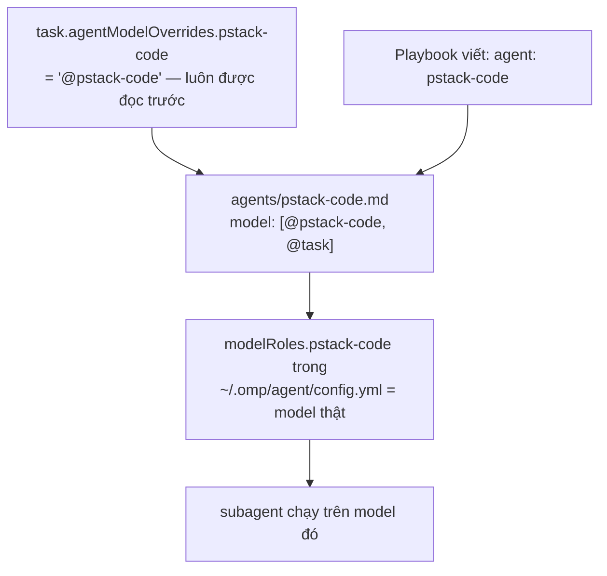

# pstack-omp là gì

`pstack-omp` là một OMP plugin (marketplace: `pstack`, version `0.15.2`), port lại bộ plugin `pstack` của poteto từ Cursor (`cursor/plugins/pstack`) sang OMP. Toàn bộ port này là 8 commit, một tác giả, một ngày (2026-09-15). Nó không phải một tool hay service chạy nền, nó là một tập hợp **skill** (file markdown hướng dẫn hành vi của agent), **agent** (file cấu hình model), và một ít **script** thật (TypeScript/bash) mà các skill gọi tới khi cần giữ state hoặc quyết định máy móc.

Mục đích: biến một phiên làm việc coding thành một quy trình có kỷ luật, thay vì để agent tự do tùy hứng. Trọng tâm của toàn bộ plugin là **poteto-mode**.

```
skills/poteto-mode/        skill trung tâm (mode)
  SKILL.md                 143 dòng: trigger, nguyên tắc, autonomy, subagent, reply, danh mục playbook
  playbooks/*.md            23 quy trình cụ thể (feature, bug-fix, shipping, orchestrate, ...)
  scripts/                  code thật: watch-pr, orch, check-plan.mjs, worktree-audit.sh
skills/how/, why/, arena/, architect/, interrogate/, reflect/, swarm/
                            các skill "routing": tự spawn subagent riêng của chúng
skills/unslop/, tdd/, no-comments/, figure-it-out/, technical-writing/, show-me-your-work/
                            các skill "instruction": không spawn, chỉ đổi cách agent hiện tại làm việc
skills/principle-*/         23 leaf-skill, mỗi file là một nguyên tắc được index từ SKILL.md
skills/setup-pstack/        skill duy nhất ghi cấu hình routing model (~/.omp/agent/config.yml)
agents/pstack-{code,judgment,tooling,panel-1..4}.md
                            7 "role agent", mỗi cái chỉ để mang một model
agents/poteto-agent.md, agents/comment-sicko.md
                            2 agent phụ, luôn chạy trên model của session cha
```

## Toàn bộ danh mục skill (23 skill + 23 principle)

Phần trên chỉ đi sâu vào `poteto-mode`. Plugin có 46 thư mục trong `skills/`, gồm 23 skill hoạt động và 23 leaf-skill `principle-*`. Bảng dưới lấy nguyên câu `description:` trong frontmatter mỗi `SKILL.md` (dịch/tóm tắt), để đọc lướt là biết skill nào dùng lúc nào mà không cần mở file.

**Skill mode / trung tâm**

| Skill | Dùng khi |
|---|---|
| `poteto-mode` | Văn phong và quy trình làm việc của poteto: subagent có chủ đích, prose không sáo rỗng, code đơn giản, việc phải verify. Kích hoạt bằng "poteto", `/poteto-mode`, hoặc khi muốn agent làm việc theo phong cách này. |

**7 skill "routing" (tự spawn subagent riêng, có agent riêng)**

| Skill | Dùng khi |
|---|---|
| `how` | Hỏi "X hoạt động thế nào", cần đi qua code trước khi sửa, hoặc câu hỏi thuộc về vị trí/ownership/layer. Giải thích kiến trúc subsystem, luồng runtime. |
| `why` | Hỏi "tại sao X được làm thế này", "tại sao chọn Y", lý do thiết kế, postmortem. Tự khám phá MCP khả dụng, hỏi song song từng loại evidence (source control, issue tracker, doc dài, chat, observability, error tracking, analytics), trả về câu trả lời có trích dẫn. |
| `arena` | Spawn N candidate song song cho cùng một việc, chọn một cái làm base, ghép phần mạnh nhất của các cái thua vào. Dùng khi một lần thử cho việc phi tầm thường có nguy cơ chốt sai hướng. |
| `architect` | Phác thảo type, signature, cấu trúc module trước khi viết code, rồi theo sát khi code được điền vào. Dùng cho việc phi tầm thường mà nhảy thẳng vào code dễ chốt sai shape. |
| `interrogate` | Nhiều reviewer LLM thách thức thay đổi từ các góc độ độc lập. Dùng cho "interrogate", "adversarial review", "tìm blind spot", "chọc thủng cái này". |
| `reflect` | Spawn 3 subagent review song song trên transcript đang chạy, rút ra bài học, route mỗi bài học thành một sửa đổi cụ thể trên một skill có sẵn. |
| `swarm` | Fan-out N worker song song, gom kết quả, trả về một báo cáo. Dùng cho việc bao phủ song song, race, gauntlet, khám phá. |

**6 skill "instruction" (không spawn, chỉ đổi cách agent hiện tại làm việc)**

| Skill | Dùng khi |
|---|---|
| `unslop` | Cắt bỏ dấu hiệu văn AI khỏi mọi thứ viết ra. Luôn áp dụng. |
| `tdd` | Chỉ dùng khi được yêu cầu rõ ràng làm TDD/viết failing test/regression test, hoặc bug có target test rẻ và rõ ràng. |
| `no-comments` | Spawn "Comment Sicko" để soi comment, sửa các phát hiện được chấp nhận, đề xuất encode các ràng buộc đang được comment mô tả bằng suông. |
| `figure-it-out` | Thiết kế một playbook có thể audit được khi không playbook nào có sẵn khớp: migration lớn, thay đổi nhiều phần, việc con người review sau khi agent làm xong không giám sát. |
| `technical-writing` | Chuẩn viết kỹ thuật nhiều lớp (cấu trúc Diátaxis, văn phong Google, quy tắc STE, cú pháp Global English). Dùng khi viết/review doc, RFC, README, PR description, commit message. |
| `show-me-your-work` | Giữ một log quyết định có thể review cho việc chạy dài hoặc không giám sát: một dòng TSV mỗi quyết định (làm gì/tại sao/bằng chứng/kết quả). |

**Config**

| Skill | Dùng khi |
|---|---|
| `setup-pstack` | Cấu hình model nào bảy role agent của pstack dùng và mức reasoning budget nào. Tự dò model máy này spawn được, ghi các entry `pstack-*` vào `~/.omp/agent/config.yml`. |

**8 skill còn lại (không thuộc poteto-mode, không được `SKILL.md` của poteto-mode nhắc tới trực tiếp)**

| Skill | Dùng khi |
|---|---|
| `teach` | Giải thích một khối công việc rõ ràng để người đọc thật sự hiểu. Chạy `how` và `why` rồi dệt kết quả thành một lời giải thích liền mạch. Dùng cho "dạy tôi cái này", "giúp tôi hiểu thật sự X". |
| `recall` | Dựng lại bối cảnh làm việc gần đây từ lịch sử chat, trạng thái sống, và ghi chép chung, rồi trả về một bản tóm tắt trạng thái hiện tại. Dùng trước khi bắt đầu/tiếp tục việc, "tôi đang làm gì rồi", "tôi dừng ở đâu". |
| `automate-me` | Soạn hoặc chỉnh một skill `-mode` cá nhân hoá qua `manage_skill` + `unslop`, có thể lấy bằng chứng tươi từ transcript gần đây. Dùng cho "automate me", "tạo/refresh skill -mode của tôi", "biến thói quen làm việc của tôi thành skill". |
| `blast-radius` | Tìm xem một thay đổi có thể làm hỏng gì ở nơi khác trước khi ship, ngoài phạm vi diff, và chứng minh bằng cách chạy code thật chứ không chỉ viết ra. Dùng cho "blast radius của X", "cái này có thể làm hỏng gì", review một diff không tin tưởng. |
| `bro` | Diễn đạt lại câu trả lời trước đó bằng ngôn ngữ con người, không jargon, đơn giản và súc tích hơn. |
| `create-verification-skill` | Sinh ra một skill verification riêng cho project, lái app giống người dùng thật (bất kỳ ngôn ngữ/framework/platform nào). Dùng khi project chưa có cách script hoá để chứng minh hành vi UI/CLI/service. |
| `maintain-verification-skill` | Lượt kiểm định kỳ giữ cho verification skill và feature map của project luôn đúng: đọc song song theo từng feature, một session sống lái từng feature, tối đa một PR sửa lỗi đã chứng minh. |
| `typescript-best-practices` | Best practice TypeScript. Tự áp dụng khi đọc/sửa bất kỳ file `.ts`/`.tsx` nào (khai báo qua `paths:` trong frontmatter, không phải mô tả tự nhiên). |

**23 leaf-skill `principle-*`** (mỗi file một nguyên tắc, chỉ đọc khi cần áp dụng, được index ở `SKILL.md:37-78` của poteto-mode): attack-the-premise, boundary-discipline, build-the-lever, encode-lessons-in-structure, exhaust-the-design-space, experience-first, fix-root-causes, foundational-thinking, guard-the-context-window, laziness-protocol, make-operations-idempotent, migrate-callers-then-delete-legacy-apis, minimize-reader-load, model-the-domain, never-block-on-the-human, outcome-oriented-execution, prove-it-works, redesign-from-first-principles, separate-before-serializing-shared-state, sequence-verifiable-units, subtract-before-you-add, test-behavior-not-implementation, type-system-discipline. Tên file đã tự mô tả khi nào dùng; chi tiết nằm trong từng file, cố tình không nhồi vào `SKILL.md` chính.

## poteto-mode hoạt động thế nào

Không có cơ chế "matcher" nào bằng code cả. `SKILL.md` là văn xuôi thuần túy, việc match request vào playbook nào diễn ra hoàn toàn trong đầu model đang đọc file này. Đây là tính chất xuyên suốt toàn bộ plugin: mọi hợp đồng (contract) đều được thực thi bằng cách agent đọc và làm theo, không có code nào kiểm tra hay ép buộc.

`SKILL.md` gồm các phần theo thứ tự:

1. **Non-negotiables** (dòng 13-36): mở đầu bằng yêu cầu nêu tên nguyên tắc đã áp dụng cho quyết định, sau đó là danh sách trigger, mỗi dòng ánh xạ một dạng request vào một skill/playbook (thay đổi phi tầm thường → skill `how`; thay đổi cắt qua function boundary → `architect`; fan-out song song → `swarm`/`arena`; thiết kế gây tranh cãi → `interrogate`; hỏi trạng thái PR → playbook Babysit; đẩy một stack lên → Shipping).
2. **Principles** (37-78): mục lục 23 leaf-skill `principle-*`, đọc file gốc trước khi áp dụng, không nhồi chi tiết vào file luôn được load.
3. **Autonomy** (79-88): việc reversible thì cứ làm, việc irreversible thì dừng lại chờ người.
4. **Subagents** (89-96): hợp đồng phân việc, bảy role agent là nơi mang model.
5. **Writing the reply** (97-110): văn phong bắt buộc cho câu trả lời cuối (câu ngắn, khai báo, không dùng dash dài, mỗi claim gắn nhãn đo được/suy luận/đoán).
6. **Playbooks** (115-143): danh mục 23 quy trình.

Khi một request khớp một playbook, agent mở file playbook đó và copy nguyên văn từng bước vào todo list, bước nào bỏ qua thì giữ lại với ghi chú `skip: lý do`. Nếu không playbook nào khớp, dùng `figure-it-out` để tự thiết kế một plan riêng.

22 trên 23 playbook dùng chung một khuôn: tiêu đề, một dòng đậm tuyên bố sở hữu (`**You own ...**`), các bước đánh số bằng câu mệnh lệnh, và một dòng `**Reply:**` ở cuối liệt kê nội dung bắt buộc phải có trong câu trả lời (ví dụ `bug-fix.md` bắt output repro fail-rồi-pass nguyên văn, `worktree-cleanup.md` bắt số liệu `df -h /` trước/sau). File duy nhất phá khuôn này là `opening-a-pr.md`: không có dòng sở hữu, không bước đánh số, không Reply, vì bản thân nó là điểm đến chung của 7 playbook có diff để land (bug-fix, feature, hillclimb, perf-issue, refactoring, visual-parity, authoring-a-skill).

## Bảy role agent và việc route model

`task` tool của OMP không có field `model` riêng cho từng item được spawn. Vì vậy phải có "agent mang model hộ": bảy file `agents/pstack-*.md`, mỗi file chỉ có nhiệm vụ giữ một model cụ thể trong frontmatter của nó.



`/skill:setup-pstack` ghi đủ 14 giá trị: 7 dòng `modelRoles.pstack-*` (model thật) và 7 dòng `task.agentModelOverrides.*` (chỉ chứa alias, không chứa model thật — nếu chứa model thật thì nó luôn thắng và việc đổi model sau này trong `modelRoles` sẽ vô tác dụng một cách âm thầm). Ý nghĩa từng role:

| Role | Dùng cho |
|---|---|
| `pstack-code` | 5 playbook build chính (bug-fix, feature, hillclimb, perf-issue, refactoring), swarm worker, explorer của how/why |
| `pstack-judgment` | synthesizer của how/why, cross-judge của arena, reflect |
| `pstack-tooling` | lăng kính tooling của reflect |
| `pstack-panel-1..4` | các ghế review của arena/architect/interrogate |

`poteto-agent` và `Comment Sicko` nằm ngoài bảy role này, không có field `model`, luôn chạy trên model của session cha.

## Script thật, không phải trang trí

5 playbook gọi tới `skills/poteto-mode/scripts/`, và đây là code thật có test, không phải mô tả suông:

- **`watch-pr/`**: bộ theo dõi PR đứng sau Babysit và Shipping. `github.ts` gọi `gh`/`git`/GraphQL, `policy.ts` là logic quyết định thuần (phân loại blocker, backoff, state machine cho việc gom một stack PR), `render.ts` in ra bảng markdown 4 cột (PR/CI/Review/Merge) mà playbook hứa trong Reply. Có exit code riêng cho từng loại chặn (conflict, review thread, CI fail, merge gate...).
- **`orch/`**: bộ nhớ cho playbook Orchestrate (chương trình chạy nhiều ngày). Lưu trạng thái vào file TSV/JSON phẳng (`units.tsv`, `ledger.tsv`, `frontier.json`...), ghi có khóa (lock file `O_EXCL`, tự chiếm lại nếu lock cũ đã chết).
- **`check-plan.mjs`**: linter cấu trúc cho khung kế hoạch của `multi-phase-plan.md`, bắt buộc đúng heading, đúng số khối, và cả những cụm chữ cố định phải xuất hiện nguyên văn trong plan.
- **`worktree-audit.sh`**: chỉ đọc, xếp hạng các worktree không phải main theo mức độ an toàn để xoá (không tự xoá gì cả).

## Drift đã sửa (2026-09-16)

Bốn mục dưới từng là drift thật, đã kiểm chứng rồi sửa trong cùng phiên. Giữ lại vì chúng giải thích vì sao repo có những câu chữ hiện tại.

- **`SKILL.md:91` mâu thuẫn với playbook về agent.** Dòng cũ bảo dùng `agent: "poteto-agent"` cho mọi subagent trong playbook step, nhưng mọi chỗ playbook chỉ định code delegate lại viết `agent: "pstack-code"`. Câu sót từ bản Cursor gốc, lúc đó chưa có 7 role agent. Đã đảo lại ưu tiên: agent mà step hoặc routed skill nêu tên thì thắng, `poteto-agent` chỉ dành cho helper ad-hoc không step nào nêu tên. Sửa kèm `README.md` và `agents/poteto-agent.md`, cả hai đều chép câu "spawning any other agent skips that read and drifts".
- **"Opening a PR gọi ở cuối mọi playbook khác"** (ở `SKILL.md`, `opening-a-pr.md`, và bảng playbook trong README) chỉ đúng 7/22. Đã đổi thành tiêu chí "every playbook that lands a diff", không hardcode danh sách 7 tên vì danh sách sẽ rot còn tiêu chí thì không. Nhóm còn lại tự có trạng thái kết thúc riêng (forensics chỉ trả lời, `investigation.md` nói thẳng "No PR, no babysit").
- **Đường dẫn Cursor cũ `pstack/skills/...`** trong `multi-phase-plan.md`, `autopilot-full.md`, `autopilot-stack.md`. Repo không có thư mục `pstack/`, và các file này nằm trong plugin chứ không nằm trong repo project, nên `git show origin/main:pstack/skills/...` fail ở cả hai lẽ. Đã đổi sang `skill://`, đúng idiom repo đã dùng ở `shipping.md`, `babysit.md`, `orchestrate.md`.

  Cái bẫy ở đây: `check-plan.mjs:22` có `PROGRAM_MARKERS` chứa literal `"git show origin/main:"`, tức linter bắt buộc chuỗi đó phải tồn tại trong plan. Xoá sạch là fail mọi plan. Phải tách hai loại đường dẫn, `git show origin/main:<control surface path>` (file trong repo project) giữ nguyên, chỉ đường dẫn skill mới đổi sang `skill://`.
- **Frontmatter 7 file `agents/pstack-*.md`** mô tả "falling back to the task role", trong khi `setup-pstack/SKILL.md` nói role không set thì chạy trên session model. Đã sửa mô tả cho khớp `setup-pstack`. Field `model:` giữ nguyên chuỗi fallback, nó vô hại khi frontmatter có hiệu lực.

**Panel review không còn là drift.** Bản trước ghi cả 4 slot `pstack-panel-1..4` trỏ cùng một model. Kiểm lại `~/.omp/agent/config.yml` thì đã là 4 family khác nhau (claude-sonnet-5, gemini-3.8-flash, grok-4.6, kimi-k3), tức ai đó đã chạy lại `setup-pstack`. Không sửa gì.

## Còn để ngỏ

- **Lý do gốc trong commit `0080768`** ("agent cài từ marketplace không đọc được `model` trong frontmatter") không tái hiện được khi kiểm tra trực tiếp trên source code harness đang cài (omp 18.1.21). Có khả năng thí nghiệm gốc bị nhiễu bởi việc agent ở project che agent ở plugin, chứ không hẳn do frontmatter bị bỏ qua. Cơ chế hai khối cấu hình hiện tại vẫn đúng và tất định dù lý do gốc chưa chắc chắn. Đây là nghi vấn về *lý do*, không phải bug, nên không sửa gì.

## Vì sao nó được xây theo kiểu này

Kiểm tra bằng cách so từng dòng `SKILL.md` ở đây với bản gốc `cursor/plugins/pstack` 0.15.2: mọi phần tạo nên "mode" (sticky mode, Non-negotiables, autonomy split, ý tưởng tiered delegation) giống nhau đến từng byte. Toàn bộ ~30 dòng thay đổi trong port chỉ là chuyển máy móc Cursor sang OMP. Nói cách khác, repo này không tự thiết kế cái mode, nó thừa hưởng nguyên bản từ poteto và chỉ tự phát minh phần cơ chế bên dưới (7 role agent, 2 khối config, 4 script). Lý do triết lý thật sự đằng sau việc chọn "mode sticky" thay vì skill một lần thì không nằm trong repo này để tìm, nó thuộc về lịch sử của bản gốc bên Cursor.

Lý do duy nhất được ghi lại cho chính sách autonomy (không chặn con người khi việc reversible) nằm ở `skills/principle-never-block-on-the-human/SKILL.md`, cũng nguyên văn từ bản gốc: mỗi lần dừng chờ người là một điểm nghẽn, code thay đổi được và review được nên một quyết định sai thường rẻ hơn việc chặn pipeline lại.
